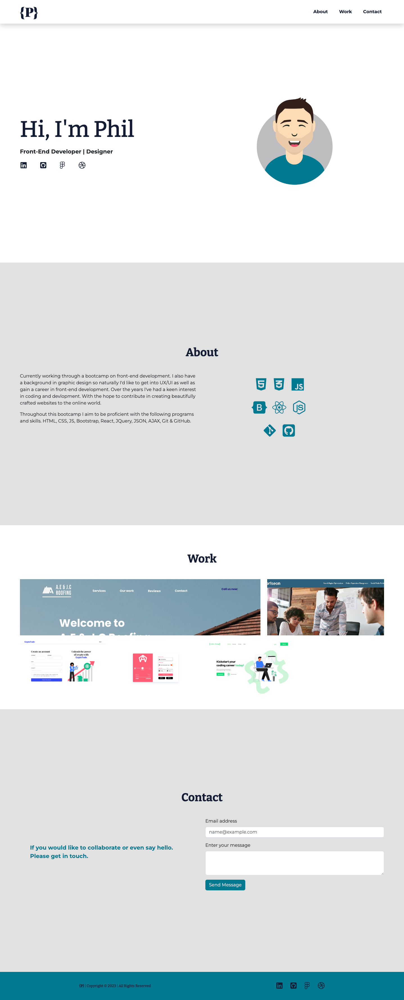

# Bootstrap-Portfolio

## Description

For this portfolio I have re-created and slightly redesigned my original portfolio. This time I have used the Bootstrap CSS Framework for the layout.

Making sure I reached the following criteria:

- A navigation bar.

  - Contain relevant links which navigate to their matching sections.

- A hero section.

  - Featuring a picture, my name and any other information.

- A work section

  - A section displaying my work in grid.
  - Use bootstrap cards for each project.
  - A description giving a brief overview of the work.

- A skills section

  - List out the skills I expect to learn from the bootcamp.

- An about / contact section.

- A footer section.
  - All hyperlinks should have a hover effect.
  - Any buttons should display a box shadow upon hover.

## Usage

The website can be accessed [here](https://philc7.github.io/Bootstrap-Portfolio/)

Here is how the desktop version looks

## Credits

### Here are a few references that helped me create my portfolio

[CSS Transitions](https://www.w3schools.com/css/css3_transitions.asp)

[Bootstrap Framework](https://getbootstrap.com/)

[Bootstrap basics (web dev simplified)](https://www.youtube.com/watch?v=Jyvffr3aCp0))

[Icons (Font Awesome)](https://fontawesome.com/)

[Fonts](https://fonts.google.com/)

## License

Please refer to the LICENSE in the repo.
